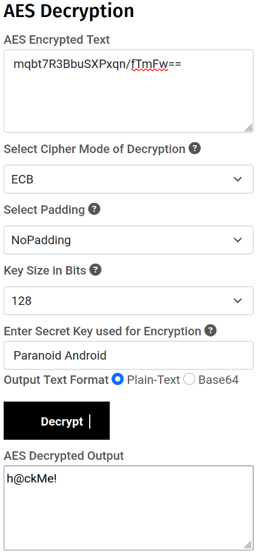
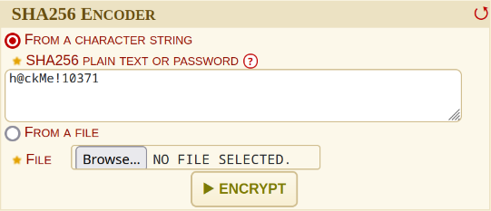
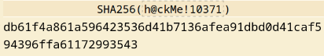

# SQL-Injection
An SQL-Injection sandbox to understand basic concepts of database related cybersecurity. Additionally the folder swaggerhub-sql-sandbox/ contains attempts at attacking a university server whose weak point was bad sql handling. All attacks were performed after acquiring permission from the university.

### Train of thought 
Going through the tables I stumble across a super unsuspicious table mentioning many different Algorithms. Having also seen the other tables, the last entry catches my eye:

- AES128NoP: Refers to the 128 bits AES algorithm with no padding.
    - The pkey hint is Greek Athlete
    - Going through the athletes table we see "Giorgos Karagounis"
    - The gossip hints to a Radiohead song
    - Inside the totallyCalmingMusic table there is the Radiohead song "Paranoid Android"
    - So our 16 bit key is: "Paranoid Android"



- The 8th entry inside the totallyCalmingMusic table was suspiciously "Salty" and "RedHat", so:
    - This entry's closer is: "GOTO animeMovieCharacters 4"
    - The 4th entry of the table animeMovieCharacters is: "Luffy"
    - Whose spoiler is: "mqbt7R3BbuSXPxqn/fTmFw=="
    - By using the AES128NoP algorithm with the 16 bit key "Paranoid Android"
    - I get the result: "h@ckMe!"




The queries that can be used to 
1. Get the necessary information from the database to solve the riddle and 
2. Insert the name, AEM and hashed password as we were prompted are as follows:
```sql
-- Query 1
select songname
from totallyCalmingMusic
where songname = "RedHat"
union
select spoilers
from animeMovieCharacters
where id = 4
union
select algo
from superUnsuspiciousTable
where id = "5"
union 
select songname
from totallyCalmingMusic
where songartist = "Radiohead";

-- Query 2
insert into 
    totallyCalmingMusic 
values (
    "13",
    "10371", 
    "Papadakis Konstantinos Fotios", 
    "db61f4a861a596423536d41b7136afea91dbd0d41caf594396ffa61172993543"
);
```

Sources
-------------------------------------
- https://www.devglan.com/online-tools/aes-encryption-decryption
- https://www.dcode.fr/sha256-hash